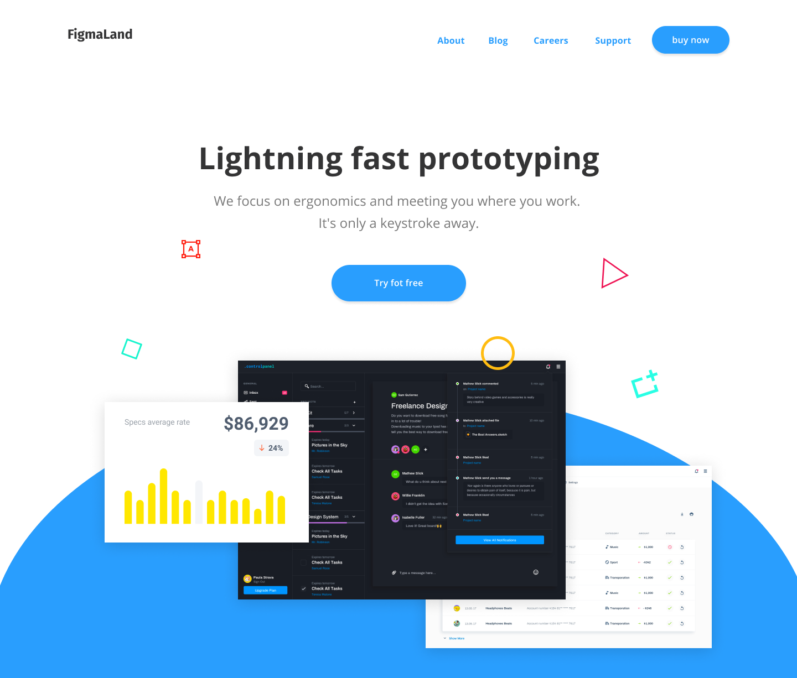

# Landing page headers - Header (1)

This is a solution to the [Figmaland Headers UI design - Hero(1)](https://www.frontendmentor.io/challenges/intro-section-with-dropdown-navigation-ryaPetHE5).
## Table of contents

- [Overview](#overview)
  - [The challenge](#the-challenge)
  - [Screenshot](./)
  - [Links](#links)
- [My process](#my-process)
  - [Built with](#built-with)
  - [Useful resources](#useful-resources)
- [Author](#author)

## Overview

### The challenge

Users should be able to:

- View the optimal layout for the content depending on their device's screen size
- See hover states for all interactive elements on the page

### Screenshot

### Links

- Solution URL: [https://github.com/asamoahe3/figmalandui-header-a](https://github.com/asamoahe3/figmalandui-header-a)
- Live Site URL: [https://nakoyawilson.github.io/intro-section-with-dropdown-navigation/](https://nakoyawilson.github.io/intro-section-with-dropdown-navigation/)

## My process

### Built with

- HTML
- CSS
- Figma design file

## Author

- Frontend Mentor - [@asamoahe3](https://www.frontendmentor.io/profile/asamoahe3)

